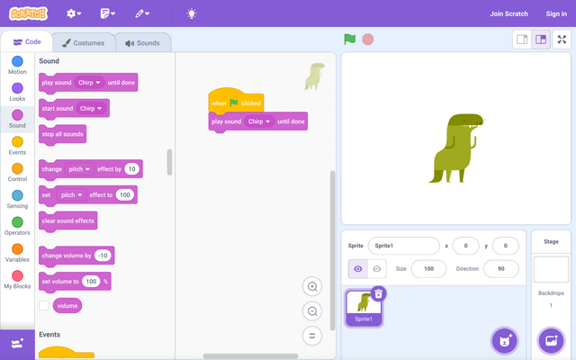
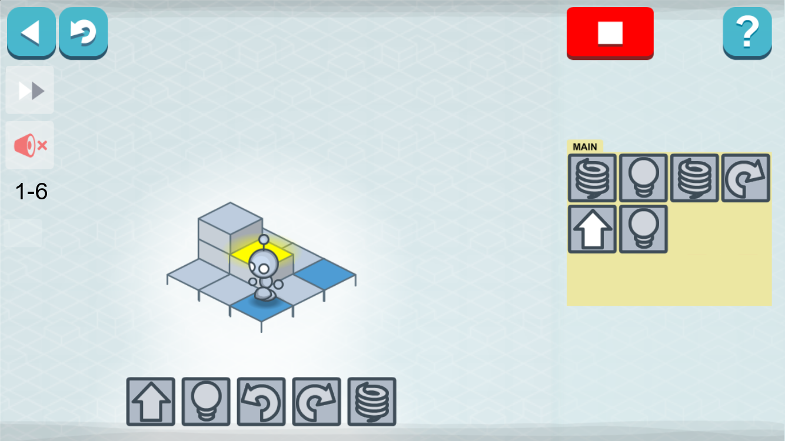

Hello, My name is Kerdon Chapman, a learning programmer based in NY. I'm learning a variety of languages at the [Brooklyn Steam Center's](https://brooklynsteamcenter.org/) Full-Stack Development pathway.

This will be my devlog in which I'll be going over changes made to my projects and updates to my programming journey.

 

# 8 Years of Coding: Recounting My Journey

As a developer who is now certified in HTML and CSS, it’s strange to look back at where I’ve started and how and to realize just how bad I was at coding. There was a time where my idea of coding was dragging blocks of instructions together. There was a point in which I didn’t even know what a programming language was. I didn’t know just how important coding would be to me.

 

 

My first experience with coding was in my 4th grade STEAM class. We used Scratch to follow along with a lesson plan to make prebuilt little games.

It was really fun, I enjoyed the challenge of having to figure out how to solve a problem using a limited set of instructions. I think it became my favorite aspect of programming, having to solve a problem and seeing the result all come together at once.

After that we moved on to some "coding games". They were basically just scratch styled, using prebuilt commands to solve problems. Lightbot and CodeCombat are the first that come to mind. They combined problem solving and video games, two things that resonated with me.

 

 

After heading into middle school, my focus shifted to more important academics. "Math" classes became Algebra and Geometry. Subjects suddenly started to become more important 